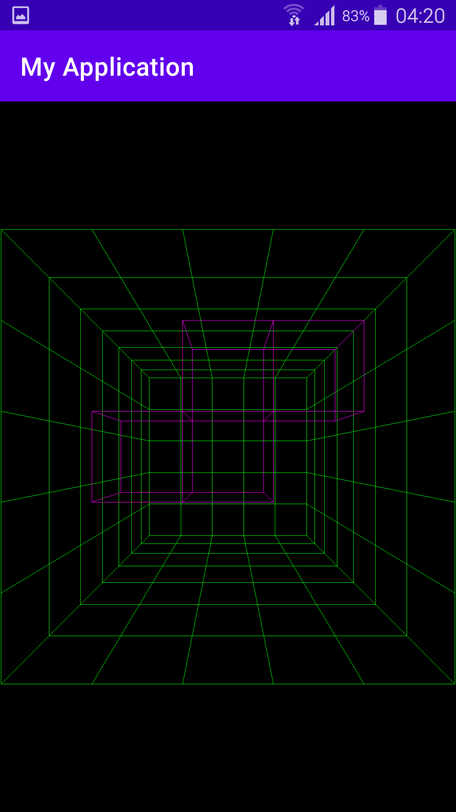
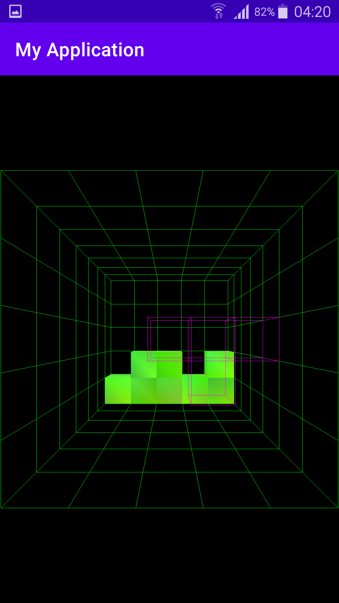
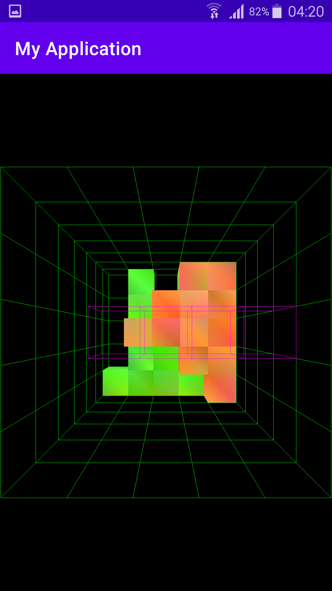
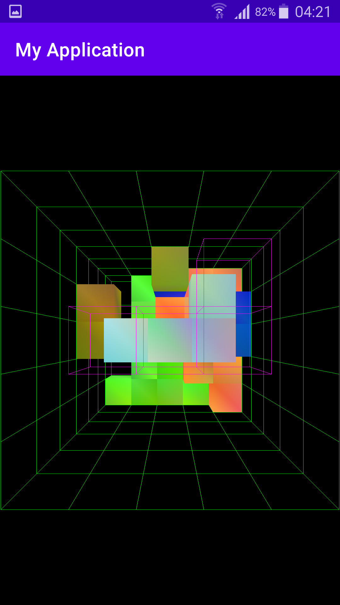

# 3D Tetrominosu kaudzēšanas spēle

Populārās MS-DOS spēles *Blockout* imitācija priekš Android viedtelefoniem.  

Programma sastādīta Kotlin un OpenGL tonēšanas valodā, izmantojot OpenGL ES zīmēšanas bibliotēku.  

Arī otrais mājasdarbs priekš *DatZ4019 : Objektorientētā programmēšana* (gandrīz visi dabūja 9, mani ieskaitot).

## Ekrānuzņēmumi

